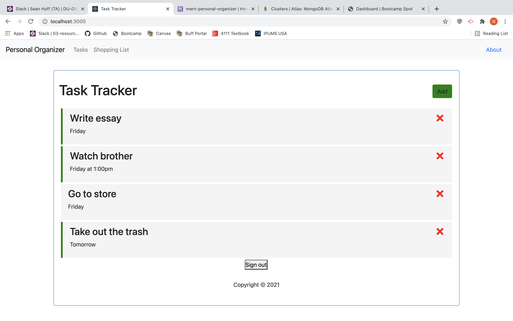

## Personal organizer

The application offers a simple-easy to use website that will allow users to keep track of tasks and appointments. The data users enter is saved in a database and persists in the database.

# Installation/Usage

To view this application, navigate to xxxx in your browser. TO run the application locally, clone the repo to your desktop and type "npm run start" in your CLI.
See package.json and run npm i to install dependencies

# Technologies

This application was built using react. It also uses React for the front end, MongoDB Atlas for the database, Express for the backend, Node Js for the web server and several node packages.

# Challenges

This application is the result of a group product. It certainly suffered from a challenging group dynamic. However, we persevered through the challenges to successfully complete a minimum viable product on time.
Additionally, authentication presented a massive challenge, as did the ultimate heroku deployment.
